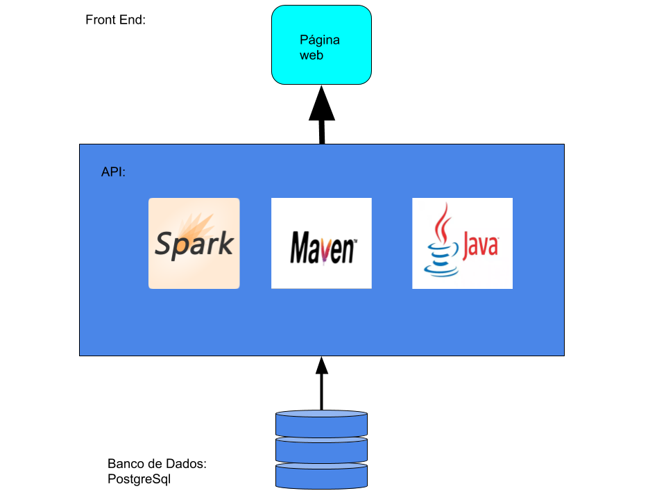
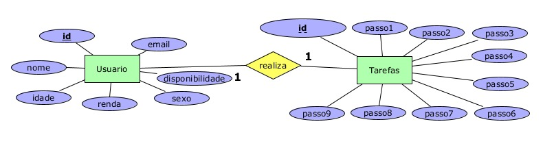
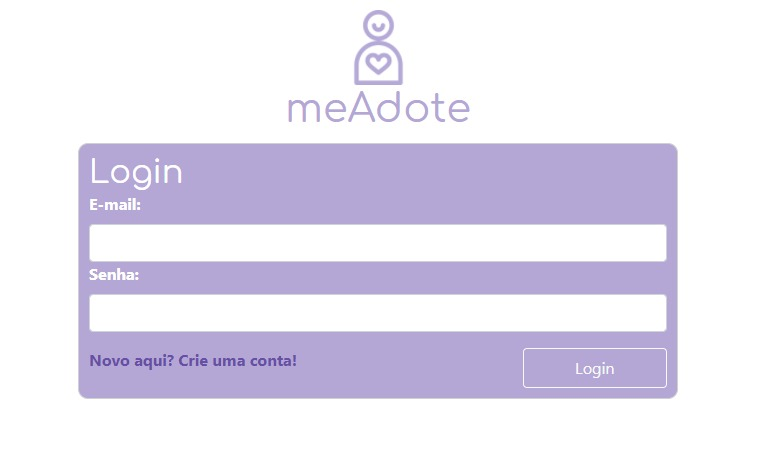
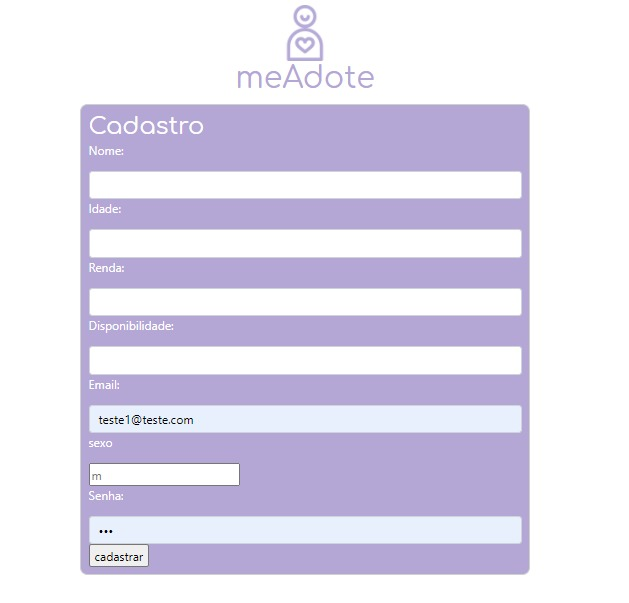
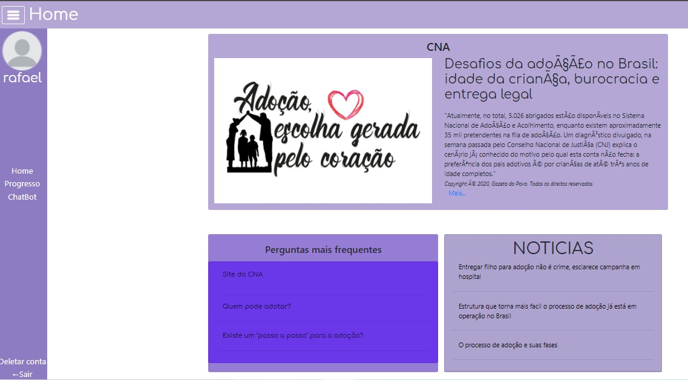
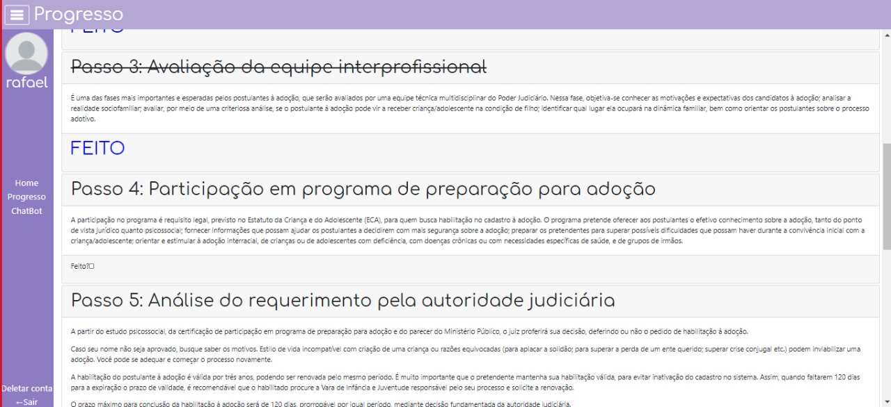
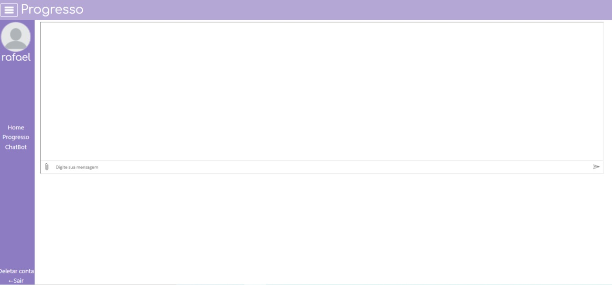
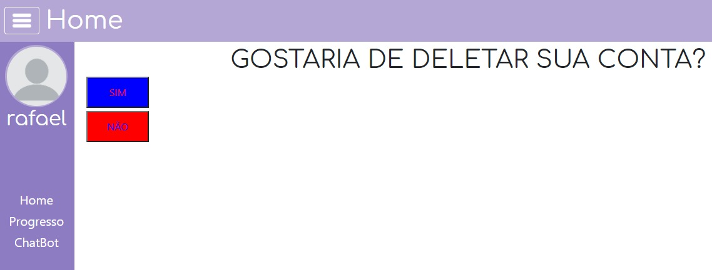

# MeAdote-TI2

**Rafael Pinto Mesquita, reifel.mesquita@gmail.com**

**Victor Hugo de Sá Parreiras, victorsa6@hotmail.com**

**Gustavo Rafá Pinheiro da Silva, gustavorafa128@gmail.com**

---

_Curso de Ciência da Computação, Unidade {Coração Eucarístico | Praça da Liberdade}_

_Instituto de Informática e Ciências Exatas – Pontifícia Universidade de Minas Gerais (PUC MINAS), Belo Horizonte – MG – Brasil_

---

O nosso trabalho consiste em resolver um determinado problema, que em nosso caso optamos pelo problema da adoção no Brasil. Dessa forma precisamos desenvolver um website do qual tenha como funcionalidade um banco de dados, um sistema inteligente, e um back end para integrar os mesmos. 
Então, pensamos que como o uso do banco de dados será possível coletar informações de nossos usuários para saber o perfil de quem está interessado no processo de adoção, e para principalmente efetuar o cadastro e login em nosso site, foi usado também o banco de dados para determinar os passo a passo para o processo de adoção já feitos por cada usuário do sistema. 
Para nosso sistema inteligente, pensamos como solução a utilização de um chatbot que tem como objetivo tirar as dúvidas no processo de adoção em geral de cada pessoa que entrar em contato com o chat bot.

---

**1. Introdução**

      1.1 Contextualização
    
 É fato que no Brasil ocorre uma demora no sistema de adoção. O processo de regularizar os documentos, entrar no CNA (Cadastro Nacional de Adoção) e entrar em contato com a criança leva tempo.
    
      1.2 Problema
    
 O número de pretendentes representa nove vezes o número de crianças aptas para adoção, mas os perfis de preferência desses faz com que se torne mais difícil encontrar uma criança. Um exemplo, é a escolha de idades, onde 85% dos pretendentes preferem crianças com até 6 anos de idade.
 A solução criada deve afetar o nicho dos futuros pais, aqueles que pretendem adotar, estão na espera de uma adoção na fila do CNA e aqueles que já adotaram e impõem influência para outros pretendentes. O ambiente escolhido seria um site que, por ser mais dinâmico, permite o acesso por vários dispositivos, sendo favorável para a formação de comunidades.

      1.3 Objetivo geral

 O objetivo central é desenvolver um site para cooperar na aceleração do processo de adoção. Os objetivos específicos seriam conscientizar os pretendentes sobre os perfis das crianças no Brasil e ajudá-los a passar pelo processo de adoção de forma mais organizada e explicativa. Com isso, é favorecida uma relação de cooperação entre sistema e o usuário.

        1.3.1 Objetivos específicos

* Proporcionar uma interface organizada para responder dúvidas e permitir que os usuários gerenciam seus processos de adoção.
* Auxílio no passo a passo da adoção, acompanhando de maneira detalhada

      1.4 Justificativas
	
  A motivação da nossa solução é ajudar mais de 4000 crianças a serem adotadas, permitindo que elas tenham suporte familiar ao longo de suas vidas. Os objetivos foram escolhidos para tentar conscientizar os pretendentes sobre as escolhas de perfis e consequentemente fazer com que aquelas crianças com fatores e características menos procuradas tenham maior chance de serem adotadas e também foram escolhidos para auxiliar os pretendentes a conseguir realizar a adoção de forma boa e organizada. 

**2. Projeto da Solução**

    2.1. Requisitos funcionais
	
Enumere os requisitos funcionais previstos para a sua aplicação. 
Use a tabela abaixo para enumerá-lo.  Esses requisitos devem estar 
de acordo com as definições do modelo de negócio.

| No.   | Descrição                                                                                               | Prioridade  |
| ----- |:-------------------------------------------------------------------------------------------------------:| -----------:|
| RF-01 |                     O usuário deve conseguir criar uma conta e logar no sistema.                        |    Alta     |
| RF-02 |                         O usuário deve conseguir utilizar o nosso chatbot (FAQ)                         |    Alta     |
| RF-03 |                    O usuário deve ter uma checklist para gerenciar seu passos na adoção                 |    Alta     | 
| RF-04 |    O usuário deve ter um suporte visual (barra de progresso) para representar seu progresso na adoção   |    Alta     | 
| RF-05 |        O sistema deve possuir uma integração com backend, sincronizando o site e o banco de dados       |    Alta     | 
| RF-06 |                        O sistema deve possuir um banco de dados para login.                             |    Alta     |  
| RF-07 | O sistema deve possuir um banco de dados que regula os passos que foram já realizados por cada cliente. |    Alta     | 
| RF-08 |    O usuário deve ter acesso a textos de conscientização sobre a situação atual da adoção no Brasil.    |    Média    | 

    2.2. Tecnologias

IDEs:
* Eclipse IDE

Front-end:
* HTML5
* CSS
* JavaScript
* Bootstrap

Back-end:
* Java
* Spark
* Maven

Base de dados: 
* PostgreSQL

ChatBot: 
* Microsoft Azure

    2.3. Serviços inteligentes

Descreva o mecanismo de inteligência que será utilizado no seu sistema. Utilize a modelagem baseada em agente
para definir as entradas e saídas do seu módulo de serviço inteligente. Apresente quem irá fornecer o serviço
e em que módulo será utilizado.

	
**3. Modelagem de dados**

Usuário
Descrição: Onde será cadastrado todos os usuários que quiserem saber mais sobre adoção.

Tabela:
ID: Onde armazenaremos o id de cada pessoa.
Tipo: Integer
Papel da análise: variável explicativa

Nome: Armazena o nome de cada usuário cadastrado
Tipo: String
Papel da análise: variável explicativa

Idade: Armazena a idade de cada usuário cadastrado para que possamos identificar se é possível a pessoa adotar alguém.
Tipo: Integer
Papel da análise: variável explicativa

Renda: Armazena a renda de cada usuário cadastrado para que possamos identificar se a pessoa cadastrada tem renda o suficiente para cuidar da criança.
Tipo: Integer
Papel da análise: Resposta

Sexo: Armazena o sexo de cada usuário cadastrado.
Tipo: Char
Papel da análise: variável explicativa

Disponibilidade: Armazena a disponibilidade que a pessoa tem para que seja possível cuidar da criança.
Tipo: Integer
Papel da análise: Resposta

E-mail: Armazena o e-mail para que possamos comunicar com cada pessoa cadastrada no sistema.
Tipo: String
Papel da análise: variável explicativa

Tarefas
Descrição: Onde será descrito cada tarefa que o usuário deverá fazer para conseguir uma adoção.

Tabela:
ID: Onde armazenaremos o id de cada pessoa.(fk de usuarios)
Tipo: Integer
Papel da análise: Resposta

Passo1: Armazena o Cadastro na vara da infância.
Tipo: boolean
Papel da análise: Resposta

Passo2: Armazena a participação em programa de preparação para adoção.
Tipo: boolean
Papel da análise: Resposta

Passo3: Armazena a Avaliação da equipe interprofissional.
Tipo: boolean
Papel da análise: Resposta

Passo4: Armazena a Participação em programa de preparação para adoção.
Tipo: boolean
Papel da análise: Resposta

Passo5: Armazena o Análise do requerimento pela autoridade jurídica.
Tipo: boolean
Papel da análise: Resposta

Passo6: Armazena o Ingresso no Sistema Nacional de Adoção e Acolhimento.
Tipo: boolean
Papel da análise: Resposta

Passo7: Armazena o Ingresso no Sistema Nacional de Adoção e Acolhimento.
Tipo: boolean
Papel da análise: Resposta

Passo8: Armazena o Momento de Construir novas relações.
Tipo: boolean
Papel da análise: Resposta

Passo9: Armazena o cadastro de uma nova família.
Tipo: boolean
Papel da análise: Resposta

    3.1. Diagrama de Entidade-Relacionamento

Apresente a estrutura das tabelas de banco de dados no modelo Diagrama de Entidade-Relacionamento. 
A Seguir, segue um exemplo de imagem adicionada ao documento.

**4. Sistema desenvolvido**

O sistema é simples e fácil de ser usado, começando com a tela login 

aonde se tem a opção de realizar o login se ja tiver a conta ou realizar o cadastro 

caso o usuário já tenha conta ele realizará o login sendo redirecionado para a pagina home, onde se encontra algumas notícias e dúvidas frequentes sobre o processo de adoção

Logo após o usuário poderá escolher para onde se redirecionará no site, para a tela Progresso 

Na qual tem o fluxo de passo a passo onde o usuário poderá acompanhar o seu processo de adoção de forma detalhada e organizada.
Na tela de ChatBot o usuário poderá ter uma conversa com nosso bot para tirar dúvidas frequentes sobre o tema

Caso o usuário deseje excluir sua conta ele também terá essa opção

**5. Avaliação**

Segundo o questionário o sistema atende bem as expectativas e contribui para a realização da adoção.Segue algumas avaliações:

**6. Conclusão**
  
A realização desse trabalho é algo muito novo para todos, conseguimos concluir o esperado , e todos concordamos que crescemos muito tanto intelectualmente,tanto como pessoa , pois aprendemos muito com todos. Aprendemos a lidar não só com a sua própia dificuldade mas a dos outros também, com todo mundo se ajudando e crescendo junto!

Observações pessoais:

*Rafael:"Tive algumas dificuldades que foram superadas com a ajuda dos integrantes do grupo, estou muito satisfeito com o trabalho e com o que ele nos proporcionou."
*Victor:"Durante o desenvolvimento do projeto eu adquiri muito conhecimento e cresci junto com meus colegas."
*Gustavo:"Foi muito bom fazer esse trabalho, pois consegui entender um pouco mais sobre o assunto (adoção) e consegui resolver problemas em conjunto com o grupo."

**REFERÊNCIAS**

**[1.1]** -ADOÇÃO: Perguntas frequentes. [S. l.], 2015. Disponível em: https://crianca.mppr.mp.br/pagina-2213.html. Acesso em: 03 nov. 2020.

**[1.2]** - PERGUNTAS. [S. l.], 2019. Disponível em: http://portaldaadocao.com.br/perguntas-faq. Acesso em: 03 nov. 2020.

